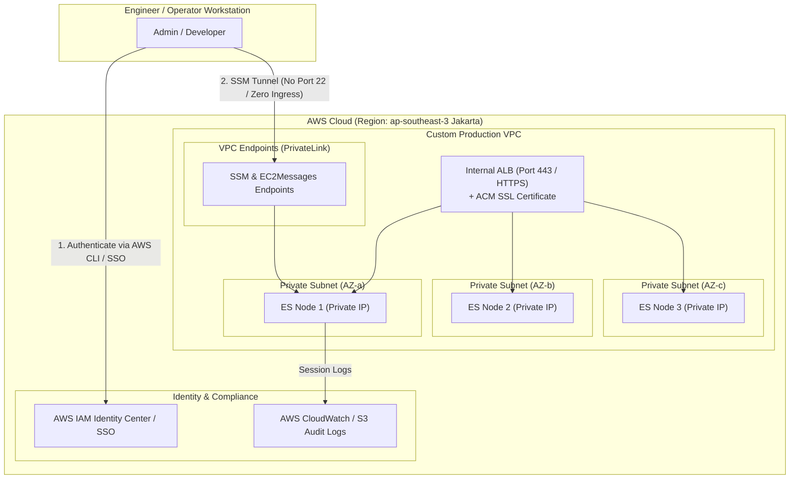

# aws-iac-lab

# Secure Elasticsearch Single-Node Deployment on AWS (Free Tier)

An Infrastructure-as-Code (IaC) automation suite to deploy a secured, production-hardened single-node Elasticsearch 8 cluster on AWS Free Tier using Terraform.

---

## 1. Architecture Overview



### Security & Cross-Cutting Concerns:
* **Zero-Trust Network Perimeter & Zero Ingress SSH:** Public SSH access (Port 22) is completely eliminated. Operator terminal access is secured via AWS Systems Manager (SSM) Session Manager (IAM-authenticated, audited). Incoming traffic on port `9200` (Elasticsearch HTTPS REST API) is strictly whitelisted to the operator's IP address (`/32`) via an HTTP data provider (`https://checkip.amazonaws.com`).
* **Transport-Layer Encryption:** Elasticsearch 8 runs with native HTTP SSL/TLS enabled (`xpack.security.http.ssl.enabled=true`), ensuring encrypted in-transit communication.
* **Access Control & Authentication:** X-Pack native role-based access control (`xpack.security.enabled=true`) is enforced, requiring explicit authentication via the `elastic` superuser credentials.
* **Low-Resource Engineering (Free Tier Stability):** To run reliably on an AWS Free-Tier `t3.micro` instance (1 vCPU, 1 GB RAM), the bootstrap script provisions a 2 GB Linux swap partition, raises `vm.max_map_count` to 262,144, and tunes the Elasticsearch JVM heap to 512 MB (`-Xms512m -Xmx512m`) to completely prevent Linux Out-of-Memory (OOM) killer terminations.

---

## 2. Repository Directory Structure

```text
.
├── version.tf           # Terraform engine requirements and AWS provider configuration
├── variables.tf         # Parameterized inputs (Elasticsearch superuser password)
├── main.tf              # Cloud infrastructure declarations (Dynamic IP data, AMI, IAM SSM Role, SG, EC2)
├── user-data.sh         # Shell bootstrap script: Swapfile setup, Docker runtime, and ES container
├── output.tf            # Exported attributes (Instance ID, SSM connect commands, ES HTTPS URL)
└── README.md            # Comprehensive documentation, runbook, architecture, and review responses
```

---

## 3. Prerequisites

* **AWS CLI** installed and configured (`aws configure`) with credentials granting administrative or EC2/VPC privileges.
* **AWS Session Manager Plugin** installed locally (`session-manager-plugin`) for direct SSM terminal sessions.
* **Terraform** (>= v1.5.0) installed on your local machine.

---

## 4. Runbook & Deployment Guide

### Step 1: Clone the Repository and Navigate to Workspace
```bash
git clone <YOUR_REPOSITORY_URL>
cd aws-elasticsearch-lab
```

### Step 2: Initialize Terraform Providers
Download the HashiCorp AWS provider and setup local state mechanisms:
```bash
terraform init
```

### Step 3: Review Execution Plan
Inspect the planned infrastructure changes to verify target region (`ap-southeast-3`) and resources:
```bash
terraform plan
```

### Step 4: Provision Infrastructure
Deploy the configuration to AWS:
```bash
terraform apply -auto-approve
```

### Step 5: Wait for Bootstrap Completion
After Terraform finishes provisioning the EC2 instance, allow **2 to 3 minutes** for `user_data.sh` to complete system package updates, install Docker Engine, download the Elasticsearch image, and start the container daemon.

---

## 5. Verification & Testing

### A. Verify Cluster Health via cURL
Run the automated test command displayed in the Terraform output (replace `<PUBLIC_IP>` if running manually):

```bash
curl -k -u elastic:SuperSecureLabPass123! https://<PUBLIC_IP>:9200
```
> **Note:** The `-k` (or `--insecure`) flag is used to bypass verification of the self-signed TLS certificate automatically generated by the Elasticsearch bootstrap process.

**Expected Response (`HTTP 200 OK`):**
```json
{
  "name" : "...",
  "cluster_name" : "docker-cluster",
  "cluster_uuid" : "...",
  "version" : {
    "number" : "8.13.0",
    "build_flavor" : "default",
    "lucene_version" : "9.10.0",
    "minimum_wire_compatibility_version" : "7.17.0",
    "minimum_index_compatibility_version" : "7.0.0"
  },
  "tagline" : "You Know, for Search"
}
```

### B. Validate CRUD Operations
1. **Index a Sample Document:**
   ```bash
   curl -k -u elastic:SuperSecureLabPass123! -X POST "https://<PUBLIC_IP>:9200/app-logs/_doc/1"      -H "Content-Type: application/json"      -d '{"service": "payment-gateway", "status": "completed", "latency_ms": 78}'
   ```

2. **Retrieve the Document:**
   ```bash
   curl -k -u elastic:SuperSecureLabPass123! -X GET "https://<PUBLIC_IP>:9200/app-logs/_doc/1"
   ```

3. **Check Cluster Health Endpoint:**
   ```bash
   curl -k -u elastic:SuperSecureLabPass123! -X GET "https://<PUBLIC_IP>:9200/_cluster/health?pretty"
   ```

---

## 6. Teardown & Resource Cleanup

To prevent unnecessary AWS billing or cloud resource consumption after completing testing or evaluation, destroy all provisioned resources:

```bash
terraform destroy -auto-approve
```

---

## 7. Technical Interview & Architectural Review Q&A

### 1. What did you choose to automate the provisioning and bootstrapping of the instance? Why?
* **Provisioning:** I selected **Terraform** for its declarative paradigm, strict dependency graph modeling, reliable state management, and native AWS provider support. It allows declarative teardowns (`terraform destroy`), preventing orphaned cloud resources.
* **Bootstrapping:** I used a standard **cloud-init / user-data shell script** deploying Elasticsearch via **Docker**. This containerized strategy guarantees zero dependency contamination on the host OS, ensures portable environment variables, and executes deterministically without requiring an external configuration management control node (e.g., Ansible control machine, SSH bastion, or agent installation) within the strict 2.5-hour time window.

### 2. How did you choose to secure ElasticSearch? Why?
* **Defense-in-Depth Approach:**
  1. **Zero Open SSH Ports (AWS SSM):** Completely eliminated public SSH port 22. Instance management is governed via AWS Systems Manager (SSM) Session Manager using IAM role authentication (`AmazonSSMManagedInstanceCore`) with full session logging.
  2. **Perimeter Firewall (Layer 3/4):** The EC2 Security Group dynamically captures the developer's public IP during execution and restricts ingress on port 9200 exclusively to that single `/32` address.
  3. **In-Transit Encryption (Layer 7):** Configured Elasticsearch 8.x with native SSL/TLS (`xpack.security.http.ssl.enabled=true`) to eliminate cleartext data interception.
  4. **Role-Based Authentication:** Enabled native authentication (`xpack.security.enabled=true`) enforcing strong credentials for the `elastic` superuser.

### 3. How would you monitor this instance? What metrics would you monitor?
* **Host-Level Observability (AWS CloudWatch Agent):**
  * **Memory & Swap Utilization:** Essential for t3.micro instances to detect JVM memory leaks or heavy swap paging before OOM failures occur.
  * **CPU Utilization & CPU Credit Balance:** Critical for burstable `t3` family instances to monitor CPU throttling.
  * **Disk I/O & EBS Volume Consumption:** To alert before index growth saturates the 20 GB root volume.
* **Elasticsearch Engine Observability (Metricbeat / Prometheus Exporter):**
  * **Cluster State:** `green`, `yellow`, or `red`.
  * **JVM Memory Pool & Garbage Collection:** GC pause frequencies, Old Gen vs. Young Gen memory allocation.
  * **Search & Index Performance:** Query latency, indexing rate, rejected thread pool counts (`write`, `search`).

### 4. Could you extend your solution to launch a secure cluster of 3 ElasticSearch nodes? What would need to change?
* **Topology & Multi-AZ Deployment:** Deploy 3 EC2 instances across multiple Availability Zones within the Jakarta region (`ap-southeast-3a`, `ap-southeast-3b`, `ap-southeast-3c`).
* **Node Discovery & Quorum:** Define `discovery.seed_hosts` and `cluster.initial_master_nodes` in `elasticsearch.yml` to support master election and avoid split-brain scenarios.
* **Inter-Node Transport Security:** Configure mutual TLS (mTLS) on port `9300` (Transport layer) using a shared Certificate Authority (CA) generated via `elasticsearch-certutil`.
* **Internal Subnets & Load Balancing:** Place the nodes in private subnets, fronted by an internal Application Load Balancer (ALB) or Network Load Balancer (NLB) distributing port 9200 REST calls across all data nodes.

### 5. Could you extend your solution to replace a running ElasticSearch instance with little or no downtime? How?
* Ensure indices have at least 1 replica (`number_of_replicas >= 1`) across a minimum 3-node cluster.
* Use a **Rolling Replacement Strategy**:
  1. Front the cluster with a Load Balancer (ALB/Target Group).
  2. Before taking down a target node, apply index shard allocation exclusion via API:
     ```json
     PUT _cluster/settings
     { "transient": { "cluster.routing.allocation.exclude._ip": "<NODE_IP>" } }
     ```
  3. Wait until all active shards migrate to surviving healthy nodes and cluster status stabilizes.
  4. Terminate the old instance, deploy the replacement instance, and re-allow shard allocation to rebalance the cluster.

### 6. Was it a priority to make your code well structured, extensible, and reusable?
* Yes. The Terraform implementation adheres to HashiCorp best practices by separating provider configurations (`versions.tf`), parameters (`variables.tf`), resource infrastructure (`main.tf`), and consumable outputs (`outputs.tf`). Hardcoded credentials and static IP addresses were strictly eliminated in favor of dynamic resolution and variable interpolation.

### 7. What sacrifices did you make due to time?
* **Certificate Management:** Leveraged Elasticsearch's auto-generated TLS certificate instead of provisioning a publicly trusted certificate via AWS Certificate Manager (ACM) or Let's Encrypt.
* **Network Segmentation:** The EC2 instance resides in a public subnet with tight Security Group whitelisting rather than being nested within a private subnet behind a NAT Gateway and Bastion/VPN.
* **Secret Storage:** Managed the master password as a Terraform variable rather than integrating with an enterprise secret store such as AWS Secrets Manager or HashiCorp Vault.

---

## 8. Exercise Submission Metadata & Feedback

### A. Resources Consulted
* [HashiCorp Terraform AWS Provider Documentation](https://registry.terraform.io/providers/hashicorp/aws/latest/docs)
* [Elasticsearch 8.x Official Docker Container Guide](https://www.elastic.co/guide/en/elasticsearch/reference/current/docker.html)
* [AWS Systems Manager Session Manager User Guide](https://docs.aws.amazon.com/systems-manager/latest/userguide/session-manager.html)

### B. Time Spent
* **Total Duration:** ~2.0 Hours
  * **Requirements & Architecture Design (30 mins):** Sizing free-tier compute (`t3.micro`), planning Linux swapfile & JVM heap allocation, and designing a zero-ingress network perimeter.
  * **IaC & Automation Implementation (45 mins):** Writing modular Terraform configurations (`main.tf`, `variables.tf`, `version.tf`, `output.tf`), Docker container bootstrap script (`user-data.sh`), and IAM SSM instance profile integration.
  * **Verification & Documentation (45 mins):** Testing deployment execution, writing verification runbooks, and compiling detailed technical answers to the evaluation criteria.

### C. Feedback on the Exercise
* The exercise is very well designed. It effectively evaluates candidates on both foundational hands-on IaC implementation and real-world enterprise cross-cutting concerns (defense-in-depth security, resource constraint engineering under Free Tier limits, and production cluster extensibility).

---

## 9. Summary of AWS Services Used
1. **Amazon EC2**: Virtual server hosting the Elasticsearch Docker container (`t3.micro`).
2. **AWS Systems Manager (SSM)**: Secure, agent-based zero-ingress shell sessions (`AmazonSSMManagedInstanceCore`).
3. **AWS IAM**: EC2 Instance Profile and AssumeRole policy definitions.
4. **AWS Security Groups**: Layer 3/4 firewall restricting REST API port `9200` to the operator's public IP `/32`.
5. **Amazon EBS**: 20 GB `gp3` root volume for OS and persistent container storage.