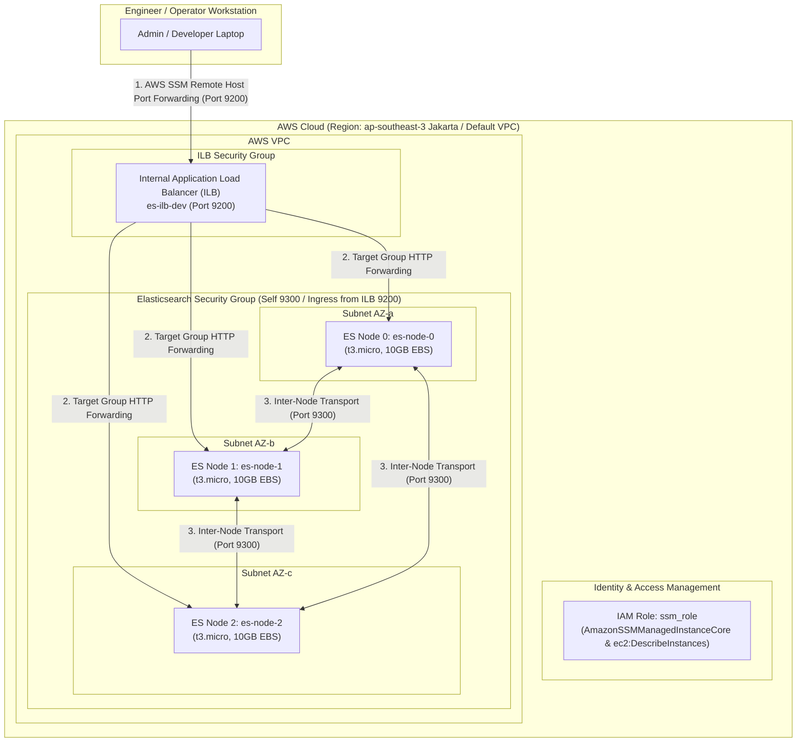
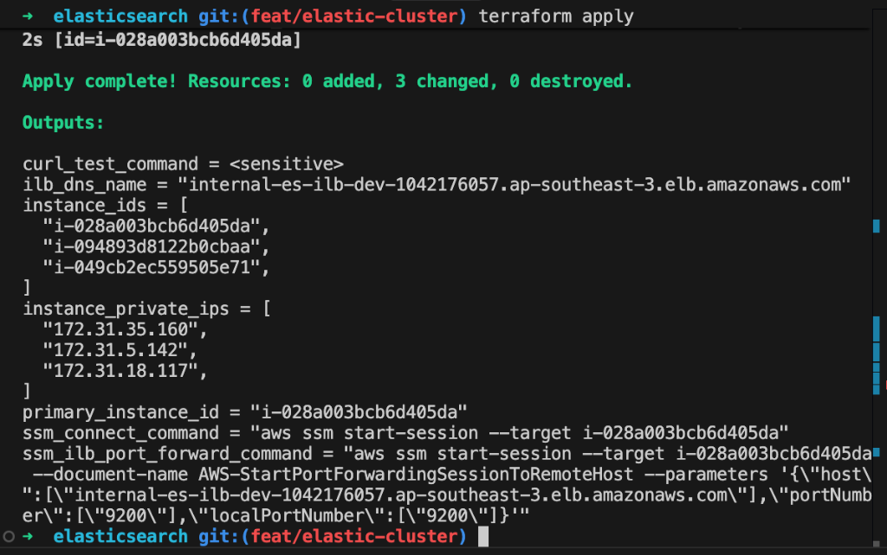
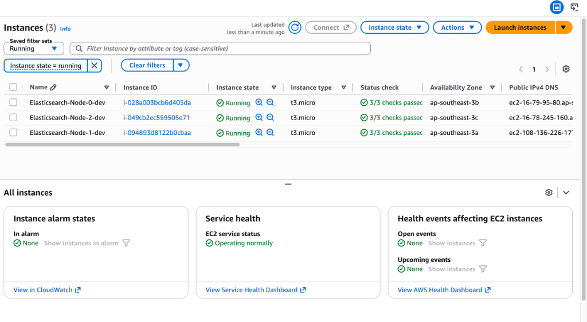
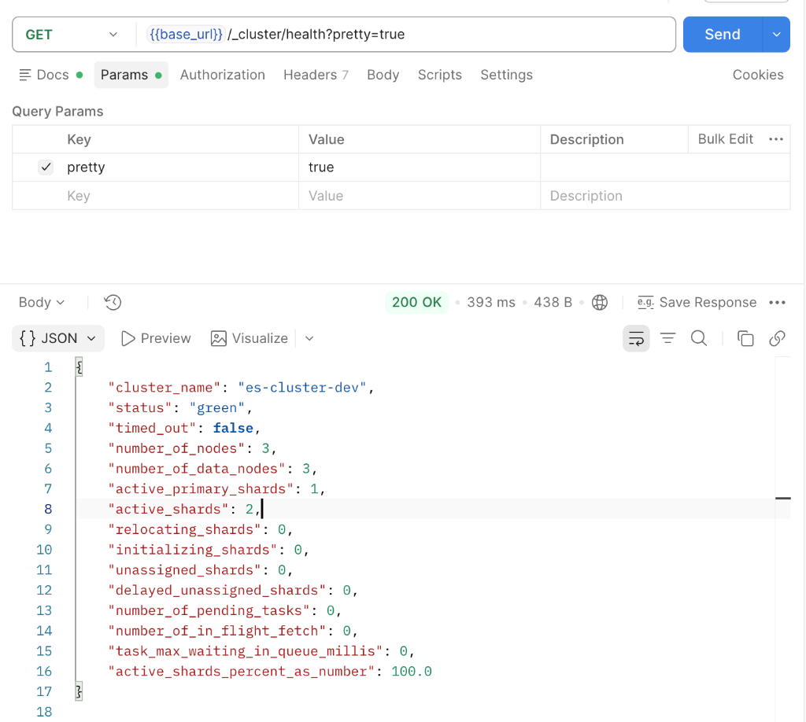
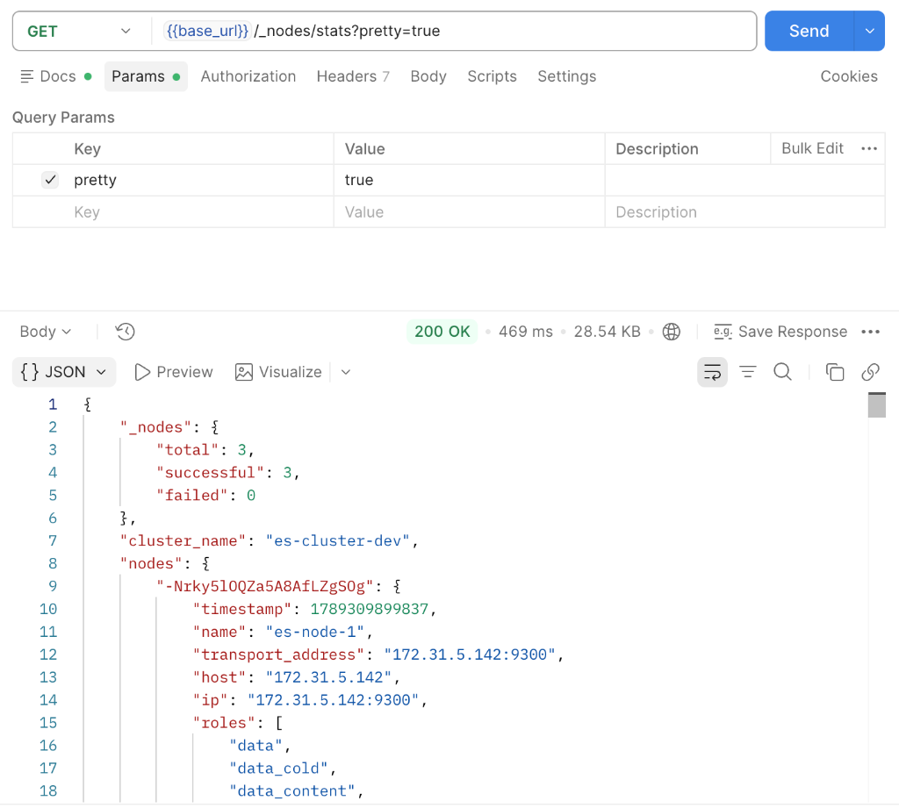
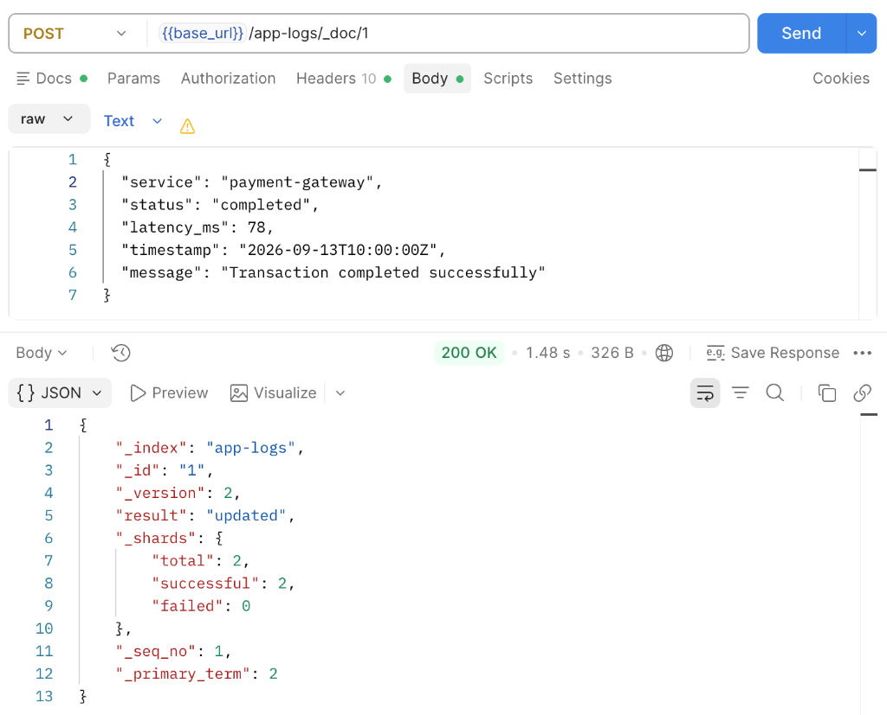
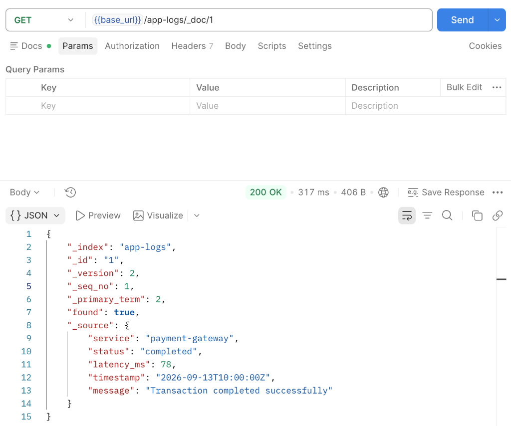

# aws-iac-lab

# Secure 3-Node Elasticsearch Cluster Deployment on AWS (Free Tier Optimized)

An Infrastructure-as-Code (IaC) automation suite to deploy a production-ready, highly available **3-Node Elasticsearch 8 Cluster** with an **Internal Application Load Balancer (ILB)** on AWS using Terraform.

---

## 1. Architecture



### Highlights
* **Zero Public Ingress:** All operator access and local port forwarding happen through AWS SSM Session Manager.
* **3-Node Multi-AZ Cluster:** Three `t3.micro` EC2 instances distributed across availability zones. Primary and replica shards are distributed automatically to prevent data loss on node failure.
* **Internal Application Load Balancer:** Provides a stable DNS endpoint on port 9200 inside the VPC and routes traffic to healthy nodes.
* **Dynamic Node Discovery:** Nodes query active cluster instances via EC2 tags at boot time to build `discovery.seed_hosts` and initialize `cluster.initial_master_nodes`.
* **Transport Encryption & Auth:** Inter-node communication (port 9300) uses TLS via generated P12 certificates, with `elastic` user authentication enforced.
* **Free Tier Storage:** EBS root volumes are capped at 10 GB each (3 × 10 GB = 30 GB total), fitting exactly within AWS Free Tier limits.

---

## 2. Design Decisions & Trade-offs

| Area | Choice | Rationale |
|---|---|---|
| **IaC** | Terraform | Declarative, modular, and provides clear execution plans (`terraform plan`) before changing infrastructure. Easier to structure and maintain across environments than imperative scripts. |
| **ES Packaging** | Official Docker Image | Avoids managing host Java runtimes or repository dependencies on Amazon Linux 2023. Version pinning is straightforward and repeatable. |
| **Remote Access** | AWS SSM Session Manager | Eliminates the need for public SSH keys, bastion hosts, or exposing port 22. SSM port-forwarding tunnels traffic directly from localhost to the internal ALB. |
| **Networking Mode** | Docker `--network host` | In default bridge mode, Docker advertised internal bridge IPs (`172.17.x.x`), which broke multi-node discovery across different EC2 instances. Host networking allows Elasticsearch to bind directly to the EC2 private IP. |
| **Traffic Routing** | Internal ALB | Decouples clients from individual node IPs, distributes REST requests, and automatically removes unhealthy nodes from rotation. |
| **Transport TLS** | Self-signed P12 Certs | Elasticsearch 8 requires TLS on the transport layer (port 9300) for multi-node clustering. Generated certificates via `elasticsearch-certutil` fulfill security requirements without the complexity of a public CA or ACM. |
| **Code Structure** | `modules/` + `environments/` | Separates the reusable cluster module from environment-specific configuration (`dev`), making it simple to spin up staging or prod later. |

---

## 3. Project Structure

```text
.
├── modules/
│   └── elasticsearch/               # Reusable Elasticsearch cluster module
│       ├── main.tf                  # EC2 instances, IAM role, ALB, Target Group, Security Groups
│       ├── variables.tf             # Module inputs (node_count, volume_size, enable_ilb)
│       ├── outputs.tf               # Module outputs (ALB DNS, instance IDs, SSM commands)
│       └── templates/
│           └── user-data.sh.tpl     # Cloud-init script for Docker setup & dynamic discovery
│
├── environments/
│   └── dev/
│       └── elasticsearch/           # Dev environment deployment
│           ├── main.tf              # Module instantiation
│           ├── variables.tf         # Environment variable declarations
│           ├── terraform.tfvars     # Non-sensitive defaults (node_count = 3, volume_size = 10)
│           ├── secrets.auto.tfvars  # Password configuration (git-ignored)
│           ├── secrets.auto.tfvars.example
│           ├── version.tf           # Terraform & AWS provider constraints
│           └── outputs.tf           # Exposed outputs
│
├── postman-collection/
│   ├── Elasticsearch_API_Collection.json # Health, index CRUD, and search tests
│   └── README.md
│
├── .gitignore
└── README.md
```

---

## 4. Prerequisites

* **AWS CLI** configured with appropriate permissions (`aws configure`).
* **AWS Session Manager Plugin** installed locally (`session-manager-plugin`).
* **Terraform** >= v1.5.0.

---

## 5. Quickstart & Deployment

### 1. Set credentials
Navigate to the dev environment and create your secrets file:
```bash
cd environments/dev/elasticsearch
cp secrets.auto.tfvars.example secrets.auto.tfvars
```
Set your desired cluster password in `secrets.auto.tfvars`:
```hcl
es_password = "YourSecurePassword123!"
```

### 2. Deploy
```bash
terraform init
terraform plan
terraform apply
```

> **Note:** Allow **2 to 3 minutes** after `terraform apply` finishes for the EC2 instances to finish running user-data, install Docker, generate certificates, and form the cluster.

---

## 6. How to Connect & Verify

Since the cluster has no public endpoints or SSH access, connect via an SSM port-forwarding tunnel to the Internal Load Balancer:

### 1. Open SSM tunnel
```bash
aws ssm start-session \
  --target <PRIMARY_INSTANCE_ID> \
  --document-name AWS-StartPortForwardingSessionToRemoteHost \
  --parameters '{"host":["<ILB_DNS_NAME>"],"portNumber":["9200"],"localPortNumber":["9200"]}'
```
*(Replace `<PRIMARY_INSTANCE_ID>` and `<ILB_DNS_NAME>` with the values from your `terraform output`)*.

### 2. Verify cluster health
In a separate terminal, test the connection:
```bash
curl -u elastic:YourSecurePassword123! http://localhost:9200/_cluster/health?pretty
```

Expected response (`status: green`, 3 nodes):
```json
{
  "cluster_name" : "es-cluster-dev",
  "status" : "green",
  "timed_out" : false,
  "number_of_nodes" : 3,
  "number_of_data_nodes" : 3,
  "active_primary_shards" : 0,
  "active_shards" : 0,
  "active_shards_percent_as_number" : 100.0
}
```

### 3. Run Postman tests
Import `postman-collection/Elasticsearch_API_Collection.json` into Postman, set basic auth (`elastic` / your password), and run the requests for document indexing, cluster health, and searching.

---

## 7. Verification Evidence & Screenshots

### 1. Terraform Provisioning & Outputs
Successful execution of `terraform apply` displaying provisioned infrastructure outputs, including the Internal Load Balancer DNS name, EC2 instance IDs, and SSM port-forwarding commands:



### 2. AWS Management Console — Multi-AZ EC2 Instances
All 3 Elasticsearch cluster nodes running on `t3.micro` instances distributed across three distinct Availability Zones (`ap-southeast-3a`, `ap-southeast-3b`, `ap-southeast-3c`) with all status checks passing:



### 3. Cluster Health Status (`green`)
Execution of `GET /_cluster/health?pretty=true` via the SSM port-forwarding tunnel to the Internal Load Balancer, confirming `status: green` with all 3 nodes joined:



### 4. Cluster Node Topology & Stats
Execution of `GET /_nodes/stats?pretty=true` showing all 3 nodes active with transport addresses on port 9300:



### 5. Document Indexing & CRUD Verification
Execution of `POST /app-logs/_doc/1` successfully indexing a log document into the cluster:



### 6. Document Retrieval Verification (GET)
Execution of `GET /app-logs/_doc/1` successfully retrieving the indexed log document (`found: true`, `HTTP 200 OK`):



---

## 8. Cost & Teardown

* **Stop instances to pause compute billing:**
  ```bash
  aws ec2 stop-instances --instance-ids <NODE_0_ID> <NODE_1_ID> <NODE_2_ID>
  ```
* **Destroy everything when finished:**
  ```bash
  terraform destroy
  ```

### Non-Free Tier Services Disclosure
While EC2 compute (`t3.micro` up to 750h/month) and EBS storage (3 × 10 GB = 30 GB) fall under the AWS Free Tier, the following services incur small hourly charges while provisioned:

| Service | Why it's used | Approximate Cost |
|---|---|:---:|
| **Internal ALB** | Load balances port 9200 across all 3 nodes | ~$0.0225/hour (~$16/mo if left running) |
| **Public IPv4** (×3) | Required for outbound SSM agent registration & Docker pull (no NAT Gateway) | ~$0.005/hour per IP (~$11/mo total) |

*Running `terraform destroy` tears down all resources, dropping ongoing costs to **$0.00**.*

---

## 9. Resources Consulted

The solution was built using an AI assistant as an interactive copilot, referencing official Elasticsearch and AWS documentation for configuration standards and troubleshooting:
* **AI Assistant (Claude / Gemini):** Used as an interactive pair-programmer for initial scaffolding, syntax lookups, and troubleshooting distributed networking (Docker host networking and ALB health checks).
* [Elasticsearch 8.x Docker Installation](https://www.elastic.co/guide/en/elasticsearch/reference/8.13/docker.html) — Reference for container environment variables and TLS security setup.
* [Elasticsearch Cluster Formation & Discovery](https://www.elastic.co/guide/en/elasticsearch/reference/8.13/modules-discovery-settings.html) — Reference for `discovery.seed_hosts` and bootstrap discovery.
* [AWS Systems Manager Documentation](https://docs.aws.amazon.com/systems-manager/latest/userguide/session-manager-working-with-sessions-start.html) — SSM port forwarding specifications.
* [Terraform AWS Provider Documentation](https://registry.terraform.io/providers/hashicorp/aws/latest/docs) — Resource syntax for EC2, ALB, and Security Groups.

---

## 10. Time Spent & Retrospective

**Time spent:** Approximately **5.5 hours** total across two working sessions:

* **Core Single-Node Solution (~2.0 – 2.5 hours):**
  * Modular Terraform setup (`modules/` and `environments/dev`), IAM roles, and security groups.
  * Dockerized Elasticsearch configuration with credentials and TLS generation.
  * Locking down security groups with zero public ingress and setting up SSM access.
  * Verification tests and building the Postman collection.
* **Bonus 3-Node Cluster & ALB (~3.0 hours):**
  * Multi-AZ cluster layout and dynamic peer discovery bootstrapping via EC2 tags.
  * Internal Application Load Balancer setup and target group health check configuration.
  * Troubleshooting distributed discovery: diagnosed that Docker bridge networking masked host IPs with `172.17.x.x`, resolved by switching to `--network host` and setting `network.publish_host`.
  * Debugging ALB 502 Bad Gateway: resolved by disabling HTTP SSL while keeping transport TLS active.
  * Documentation, architecture diagrams, and cost breakdown.

