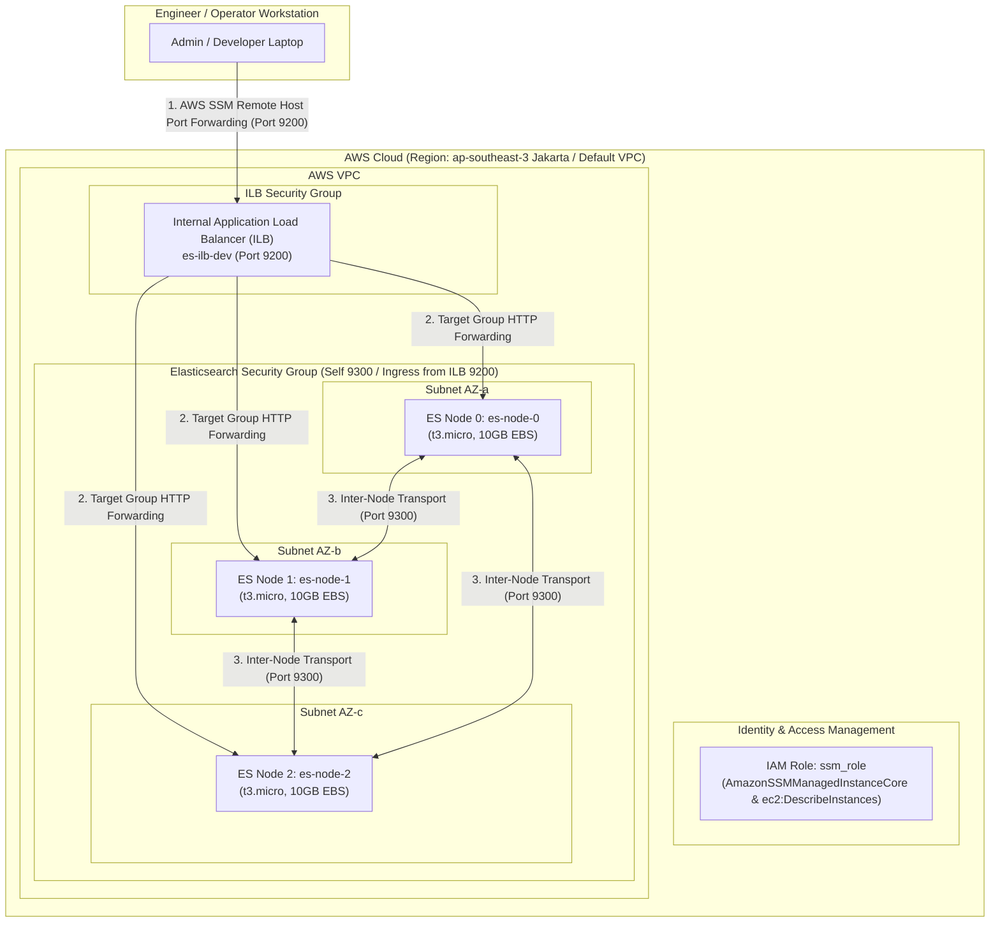

# aws-iac-lab

# Secure 3-Node Elasticsearch Cluster Deployment on AWS (Free Tier Optimized)

An Infrastructure-as-Code (IaC) automation suite to deploy a production-ready, highly available **3-Node Elasticsearch 8 Cluster** with an **Internal Application Load Balancer (ILB)** on AWS using Terraform.

---

## 1. Architecture Overview



### Key Architectural Highlights:
* **Zero-Trust Network Perimeter (Zero Public Ingress):** Security groups have zero open public ingress ports (no port 22 SSH). Administrative access and API port forwarding are securely tunneled via **AWS Systems Manager (SSM) Session Manager** with `AWS-StartPortForwardingSessionToRemoteHost`.
* **High Availability & Multi-AZ Clustering:** 3 EC2 nodes (`es-node-0`, `es-node-1`, `es-node-2`) distributed across multiple Availability Zones. Shards (Primary & Replica) are automatically rebalanced across nodes to prevent single-point-of-failure data loss.
* **Internal Load Balancer (ILB):** Fronted by an Internal Application Load Balancer (`es-ilb-dev`) that balances HTTP REST API traffic across all 3 nodes on port 9200 with automatic health checks (`/`).
* **Dynamic Node Discovery:** Nodes utilize AWS CLI EC2 tag discovery at bootstrap to dynamically discover peer private IPs and initialize `discovery.seed_hosts` and `cluster.initial_master_nodes`.
* **100% AWS Free Tier Optimized:** 
  * **Compute**: 3 `t3.micro` instances. When stopped after demos/testing, compute cost is **$0.00**.
  * **Storage**: Configured with **10 GB EBS volume per node** (3 × 10 GB = 30 GB total), fitting 100% within the 30 GB AWS Free Tier storage limit.

---

## 2. Repository Directory Structure

```text
.
├── modules/                         # Reusable Blueprint Modules
│   └── elasticsearch/               # Enterprise 3-Node Cluster Module
│       ├── main.tf                  # Resources (3x EC2, IAM SSM Role, ILB, Target Group, SG)
│       ├── variables.tf             # Inputs (node_count=3, volume_size=10, enable_ilb=true)
│       ├── outputs.tf               # Outputs (ilb_dns_name, instance_ids, ssm commands)
│       └── templates/
│           └── user-data.sh.tpl     # Bootstrap script with dynamic AWS CLI cluster discovery
│
├── environments/                    # Service-Oriented Deployments
│   └── dev/                         # Development Environment
│       └── elasticsearch/           # Dev Cluster Service Deployment (3 nodes, 10GB EBS, ILB)
│           ├── main.tf              # Module invocation
│           ├── variables.tf         # Parameter definitions
│           ├── terraform.tfvars     # Environment default values (node_count = 3, volume_size = 10)
│           ├── secrets.auto.tfvars  # Local secrets file (ignored by Git)
│           ├── secrets.auto.tfvars.example # Local secrets template
│           ├── version.tf           # Engine & Provider requirements
│           └── outputs.tf           # Pass-through module outputs
│
├── postman-collection/              # Comprehensive Postman API Suite
│   ├── Elasticsearch_API_Collection.json # Full v2.1.0 collection (Cluster Health, CRUD, Search)
│   └── README.md                    # Postman usage guide
│
├── .gitignore                       # Repository ignore rules (ignores secrets.auto.tfvars)
└── README.md                        # Project documentation and runbook
```

---

## 3. Prerequisites

* **AWS CLI** installed and configured (`aws configure`).
* **AWS Session Manager Plugin** installed locally (`session-manager-plugin`).
* **Terraform** (>= v1.5.0) installed on your local machine.

---

## 4. Runbook & Deployment Guide

### Step 1: Navigate to Dev Environment Directory
```bash
cd environments/dev/elasticsearch
```

### Step 2: Configure Secrets
Copy the secrets template and define your superuser password:
```bash
cp secrets.auto.tfvars.example secrets.auto.tfvars
```
Edit `secrets.auto.tfvars`:
```hcl
es_password = "YourSuperSecurePassword123!"
```

### Step 3: Initialize Terraform
```bash
terraform init
```

### Step 4: Validate and Review Execution Plan
```bash
terraform validate
terraform plan
```

### Step 5: Provision Infrastructure
```bash
terraform apply -auto-approve
```

### Step 6: Wait for Cluster Bootstrapping
Allow **2 to 3 minutes** for the 3 EC2 instances to complete user-data execution, install Docker Engine, query peer node private IPs via AWS CLI, and join the Elasticsearch cluster.

---

## 5. Verification & Testing

### A. Establish SSM Remote Host Port Forwarding to ILB
Establish a secure SSM tunnel from your local machine to the Internal Load Balancer DNS name:

```bash
aws ssm start-session \
  --target <PRIMARY_INSTANCE_ID> \
  --document-name AWS-StartPortForwardingSessionToRemoteHost \
  --parameters '{"host":["<ILB_DNS_NAME>"],"portNumber":["9200"],"localPortNumber":["9200"]}'
```

*(Note: Replace `<PRIMARY_INSTANCE_ID>` and `<ILB_DNS_NAME>` with the exact values output by `terraform apply`)*.

### B. Verify Cluster Health via cURL
Run the cURL command against `http://localhost:9200`:

```bash
curl -u elastic:YourSuperSecurePassword123! http://localhost:9200/_cluster/health?pretty
```

**Expected Response (`HTTP 200 OK`):**
```json
{
  "cluster_name" : "es-cluster-dev",
  "status" : "green",
  "timed_out" : false,
  "number_of_nodes" : 3,
  "number_of_data_nodes" : 3,
  "active_primary_shards" : 1,
  "active_shards" : 2
}
```

### C. Test Postman API Collection
Import `postman-collection/Elasticsearch_API_Collection.json` into Postman, set `username` = `elastic` and `password` = `YourSuperSecurePassword123!`, and execute the test suite (Cluster Health, Index Management, Document Indexing, Search Query).

---

## 6. Teardown & Cost Management

* **To Stop Cluster Instances (Zero Compute Billing):**
  When not in use, you can stop all 3 instances via AWS Console or AWS CLI:
  ```bash
  aws ec2 stop-instances --instance-ids <NODE_0_ID> <NODE_1_ID> <NODE_2_ID>
  ```
  *Compute cost while stopped is **$0.00**.*

* **To Destroy All Infrastructure:**
  ```bash
  terraform destroy -auto-approve
  ```

---

## 7. Technical Architecture Q&A

### 1. How does the 3-node cluster bootstrapping work?
Each EC2 instance executes a custom user-data script during boot that uses the AWS CLI to query active EC2 instances tagged with `Cluster = es-cluster-dev`. It collects all peer private IPs, dynamically configures `discovery.seed_hosts` and `cluster.initial_master_nodes=es-node-0,es-node-1,es-node-2`, and starts Elasticsearch in Docker.

### 2. How is network security enforced?
* **Zero Public Ingress:** No public SSH (port 22) or open HTTP ports. Access is restricted to IAM-authenticated AWS SSM Session Manager tunnels.
* **Internal Load Balancer (ILB):** Fronts the cluster inside the VPC, distributing API traffic to healthy instances on port 9200.
* **Inter-Node Transport Security:** Security group rule allows full inter-node communication on ports 9200 and 9300 exclusively between instances belonging to the cluster security group (`self = true`).

### 3. How is cost minimized on AWS Free Tier?
* Root EBS volume size is set to **10 GB per node** (3 × 10 GB = 30 GB total), keeping storage 100% within the AWS Free Tier limit.
* Instances are configured to use `t3.micro`. When stopped between demo sessions, compute cost drops to **$0.00**.